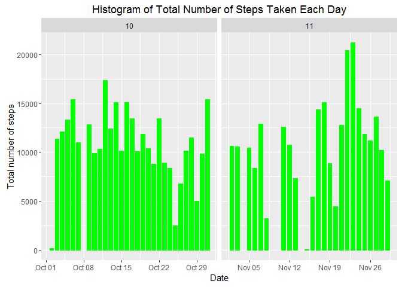
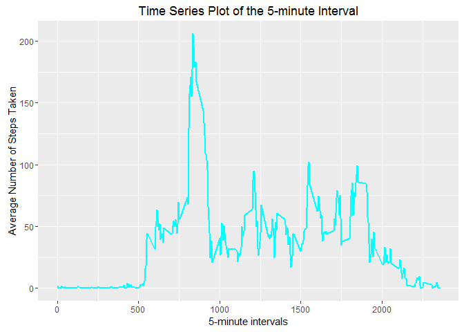
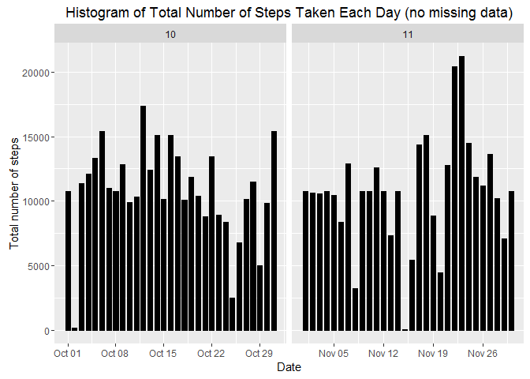

# PA1_template
John Allen  
Saturday, January 23, 2016  
Basic Settings


```r
echo = TRUE  # Always make code visible
options(scipen = 1)  # Turn off scientific notations for numbers
```

Load and Process Data


```r
data <- read.csv("C:/Users/Jono/Desktop/Coursera/Reproducible/RepData_PeerAssessment1/activity.csv", colClasses = c("integer", "Date", "factor"))
 data$month <- as.numeric(format(data$date, "%m"))
 Numbers <- na.omit(data)
 rownames(Numbers) <- 1:nrow(Numbers)
 head(Numbers)
```

```
##   steps       date interval month
## 1     0 2012-10-02        0    10
## 2     0 2012-10-02        5    10
## 3     0 2012-10-02       10    10
## 4     0 2012-10-02       15    10
## 5     0 2012-10-02       20    10
## 6     0 2012-10-02       25    10
```


```r
dim(Numbers)
```

```
## [1] 15264     4
```


```r
library(ggplot2)
```

WHAT IS MEAN TOTAL NUMBER OF STEPS TAKEN PER DAY?

For this part of the assignment, you can ignore the missing values in the dataset.

Make a histogram of the total number of steps taken each day


```r
ggplot(Numbers, aes(date, steps)) + geom_bar(stat = "identity", colour = "green", fill = "green", width = 0.7) + facet_grid(. ~ month, scales = "free") + labs(title = "Histogram of Total Number of Steps Taken Each Day", x = "Date", y = "Total number of steps")
```

 

Calculate and report the mean and median total number of steps taken per day

Mean total number of steps taken per day:


```r
totalSteps <- aggregate(Numbers$steps, list(Date = Numbers$date), FUN = "sum")$x
mean(totalSteps)
```

```
## [1] 10766.19
```

Median the total number of step taken per day:

```r
 median(totalSteps)
```

```
## [1] 10765
```

WHAT IS THE AVERAGE DAILY ACTIVITY PATTERN?

Make a time series plot (i.e. type=1) of the 5-minute interval (x-axis) and the average number of steps taken across all days (y-axis)


```r
 avgSteps <- aggregate(Numbers$steps, list(interval = as.numeric(as.character(Numbers$interval))), FUN = "mean")
names(avgSteps)[2] <- "meanOfSteps"
 
ggplot(avgSteps, aes(interval, meanOfSteps)) + geom_line(color = "cyan", size = 0.8) + labs(title = "Time Series Plot of the 5-minute Interval", x = "5-minute intervals", y = "Average Number of Steps Taken")
```

 

which 5-minute interval, on average across all the days in the dataset, contains the maximum number of steps?


```r
avgSteps[avgSteps$meanOfSteps == max(avgSteps$meanOfSteps), ]
```

```
##     interval meanOfSteps
## 104      835    206.1698
```

INPUTTING MISSING VALUES
total number of rows with NA


```r
sum(is.na(data))
```

```
## [1] 2304
```

Devise a strategy for filling in all of the missing values in the dataset. The strategy does not need to be sophisticated. For example, you could use the mean/median for that day, or the mean for that 5-minute interval, etc.

I will use the mean of the 5-minute interval to fill the missing values

CREATE A NEW DATASET THAT IS EQUAL TO THE ORIGINAL BUT INCLUDES THE MISSING DATA


```r
newList <- data 
for (i in 1:nrow(newList)) {
  if (is.na(newList$steps[i])) {
    newList$steps[i] <- avgSteps[which(newList$interval[i] == avgSteps$interval), ]$meanOfSteps
  }
}

head(newList)
```

```
##       steps       date interval month
## 1 1.7169811 2012-10-01        0    10
## 2 0.3396226 2012-10-01        5    10
## 3 0.1320755 2012-10-01       10    10
## 4 0.1509434 2012-10-01       15    10
## 5 0.0754717 2012-10-01       20    10
## 6 2.0943396 2012-10-01       25    10
```

Make a histogram of the total number of steps taken each day and Calculate and report the mean and median total number of steps taken per day.


```r
ggplot(newList, aes(date, steps)) + geom_bar(stat = "identity",
                                             colour = "Black",
                                             fill = "Black",
                                             width = 0.7) + facet_grid(. ~ month, scales = "free") + labs(title = "Histogram of Total Number of Steps Taken Each Day (no missing data)", x = "Date", y = "Total number of steps")
```

 

Do these values differ from the estimates from the first part of the assignment? What is the impact of imputing data on the estimates of the total daily number of steps?

Mean total number of steps taken each day:


```r
TotalStepcount <- aggregate(newList$steps, 
                           list(Date = newList$date), 
                           FUN = "sum")$x
TotalMean <- mean(TotalStepcount)
TotalMean
```

```
## [1] 10766.19
```

Median total number of steps taken each day:


```r
TotalMedian <- median(TotalStepcount)
TotalMedian
```

```
## [1] 10766.19
```

Compare them with the two before imputing mising data:


```r
oldMean <- mean(totalSteps)
oldMedian <- median(totalSteps)
TotalMean - oldMean
```

```
## [1] 0
```

```r
TotalMedian - oldMedian
```

```
## [1] 1.188679
```

After inputting the data, the Total Mean remains the same as the old mean while the Total Median has increased over the old median.

ARE THERE DIFFERENCES IN ACTIVITY PATTERNS BETWEEN WEEKDAYS AND WEEKENDS?

Create a new factor variable in the dataset with two levels - "weekday" and "weekend" indicating whether a given date is a weekend or weekday


```r
head(newList)
```

```
##       steps       date interval month
## 1 1.7169811 2012-10-01        0    10
## 2 0.3396226 2012-10-01        5    10
## 3 0.1320755 2012-10-01       10    10
## 4 0.1509434 2012-10-01       15    10
## 5 0.0754717 2012-10-01       20    10
## 6 2.0943396 2012-10-01       25    10
```

```r
newList$weekdays <- factor(format(newList$date, "%A"))
levels(newList$weekdays)
```

```
## [1] "Friday"    "Monday"    "Saturday"  "Sunday"    "Thursday"  "Tuesday"  
## [7] "Wednesday"
```

```r
levels(newList$weekdays) <- list(weekday = c("Monday", "Tuesday",
                                             "Wednesday", 
                                             "Thursday", "Friday"),
                                 weekend = c("Saturday", "Sunday"))
table(newList$weekdays)
```

```
## 
## weekday weekend 
##   12960    4608
```

Make a panel plot containing a time series plot (i.e. type=1) of the 5-minute interval (x-axis) and the average number of steps taken, averaged across all weekdays or weekend days (y-axis)


```r
avgSteps <- aggregate(newList$steps, 
                      list(interval = as.numeric(as.character(newList$interval)), 
                           weekdays = newList$weekdays),
                      FUN = "mean")
names(avgSteps)[3] <- "meanOfSteps"
library(lattice)
xyplot(avgSteps$meanOfSteps ~ avgSteps$interval | avgSteps$weekdays, 
       layout = c(1, 2), type = "l", 
       xlab = "Interval", ylab = "Number of steps")
```

 

END OF SUBMISSION


</body>
</html>
